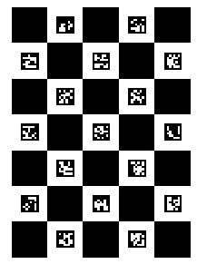
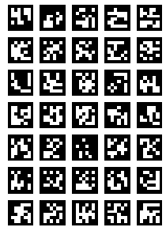

# Calibration Primer
This document discusses the "key concepts" and "terminology" that is commonly thrown around.
We'll define some of these here so the documentation you find elsewhere in this repository makes sense.

## The General Idea
Calibrating a camera in your workspace typically happens in two steps:
 1. Calibrate the "intrinsics" (i.e., the camera sensor and lens), using something like ROS' [camera calibration](http://wiki.ros.org/camera_calibration) package.
 2. Armed with the intrinsics, calibrate the "extrinsics" (i.e., the pose of the camera in your workcell).

In general, calibration routines compute the transform between the camera and the robot wrist or base, respectively.
They do so by analyzing images of calibration target: a patterned set of features with known dimensions and spacing.
This target is either statically fixed in your workcell if the camera moves (e.g., via attachment to a robot), or it is attached to a moving object (e.g., robot wrist) if the camera is statically mounted.
The calibration routines start with a guess about where the camera and calibration target are.
They then try to refine that guess through optimization into a more accurate estimation of the true position of the camera and target.

## Terminology
 - **Extrinsic Parameters**: "the extrinsic parameters define the position of the camera center and the camera's heading in world coordinates" [\[ref\]](https://en.wikipedia.org/wiki/Camera_resectioning#Extrinsic_parameters). An extrinsic calibration thus tries to find WHERE your camera is relative to some frame of reference, usually the base of a robot or the wrist of a robot.
 - **Intrinsic Parameters**: When talking about cameras, these parameters define *how* points in 3D space are projected into a camera image.
 They encompass internal properties of the camera sensor and lens such as focal length, image sensor format, and principal point.
 An intrinsic calibration tries to solve these
 - **Rectified Image**: Real world cameras and their lenses are NOT perfectly described by the pinhole model of projection.
 The deviations from that model, called *distortions*, are estimated as part of *intrinsic calibration* and are used in software to produce an "undistorted" image called the *rectified image*. Most of the calibrations in this package assume they are operating on such a rectified image.
 The ROS  [image_proc](http://wiki.ros.org/image_proc) package will usually do this for you.

## The Camera
For 2D images, we use the OpenCV model.
See [OpenCV's discussion](https://docs.opencv.org/2.4/modules/calib3d/doc/camera_calibration_and_3d_reconstruction.html) at the top of their `calib3d` module.
In brief:
  - +Z looks "down the barrel" of the camera lens
  - +Y looks down the vertical axis
  - +X looks from left to right along  the horizontal axis.

When talking about pixel space, the origin of your image is the top left corner.
The +Y axis runs down the height, and the +X axis runs right along the width.
Most of the calibrations in this repository assume they are working on an undistored or rectified image.

## The Target
The core calibrations don't make assumptions about the target; instead you just provide 2D to 3D correspondences, however you find them.
A number of OpenCV-based target finders are provided in the `target_finders` module:

### ChArUco grid target finder

Detects the intersections of a chessboard as the features to use for calibration, using the embedded ArUco tags to uniquely identify each intersection

- Pros:
  - Straightforward to detect with minimal tuning
  - Target can be partially occluded
- Cons:
  - Theoretically less accurate than the modified circle grid target, but in practice the difference is negligible

### ArUco grid target finder

Detects the corners of each ArUco marker in a grid as the features to use for calibration

- Pros:
  - Straightforward to detect with minimal tuning
  - Target can be partially occluded
- Cons:
  - Less accurate than the ChArUco grid target finder since it lacks the chessboard features
  - Theoretically less accurate than the modified circle grid target, but in practice the difference is negligible

### Modified circle grid target finder

- The one big dot allows us to disambiguate the orientation of symmetrical targets.
- The big dot is the "origin" or (0,0,0) of the target. The +Z axis comes out of the page, the +X axis runs along the bottom of the page, left to right (the last row if your big dot is in the bottom left). The +Y runs up the page from the big dot.
- When using this target finder, the points are ordered left to right, top to bottom as if reading a book.
The big dot, or origin, is in the bottom left. So the top left point is `0`, the top right point is `cols - 1`, the second row first column is point `cols`, etc. See the image.

**NOTE**: You can create targets with custom size and spacing using the handy script, `calibration_target.py` found in `target_finders/opencv/script`.
Thanks to Jeremy Zoss for making this.

- Pros:
  - Theoretically more accurate since the
- Cons:
  - Entire target must be visible
  - Detection requires tuning of many parameters
  - The grid can frequently be identified in an incorrect order

## Types of calibrations
This repository provides several types of calibration optimizations, described in more detail below.

### Extrinsic hand-eye
TODO

### Camera intrinsic
TODO

### PnP
TODO

### Multi-camera PnP
TODO

## Analysis
Just because a calibration converges *does not* mean it is accurate.
Just because a calibration converged to a low final cost *does not* mean it's a good calibration.
If you take 3000 images from the exact same position, you'll get good convergence, a very low score, and really crappy calibration.

This repository includes a number of tools in the `analysis` module for helping determine whether or not a calibration is good.
The general types of analysis tools are described in more detail below.

### Camera intrinsic calibration analysis
TODO

### Hand-eye calibration analysis
TODO

### Homography analysis
TODO

### Noise qualification
TODO

### Projection
TODO

## Some Advice
 - Take lots of samples in lots of different positions. It's not uncommon to require tens of images from all over your workspace to get a good calibration.
