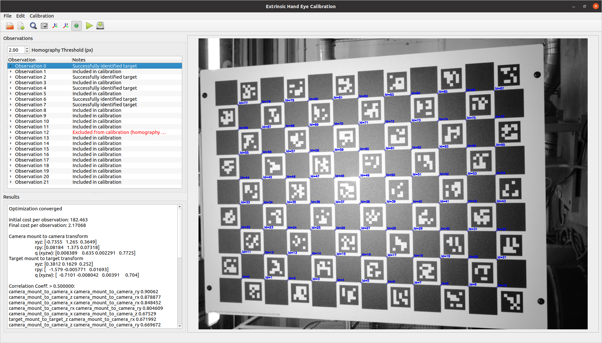

# GUI

## Extrinsic Hand Eye Calibration Application



This application performs extrinsic hand-eye calibration based on 2D camera images and measured camera/target poses.
The application requires a file that specifies the configuration of the calibration problem and the observation data to be used in the calibration.
Example configuration files can be found [here for a `ModifiedCircleGridTargetFinder`](../examples/data/test_set_10x10/cal_data.yaml)
and [here for a `CharucoGridTargetFinder`](../examples/data/test_set_charuco/cal_data.yaml).

### Observation Definition
The observation data for this application consists of:
  - Pose measurements, saved to a YAML file
      - from the camera mount frame to the camera frame, for applications where the camera is moving, or
      - from the target mount frame to the target frame, for applications where the camera is static
  - 2D image files in OpenCV-compatible formats (e.g., .png, .jpg, etc.)
  
Pose files should be specified as a position vector in meters and quaternion, in the following format:

```yaml
x:  0.0  # (m)
y:  0.0  # (m)
z:  0.0  # (m)
qx: 0.0
qy: 0.0
qz: 0.0
qw: 1.0
```

The observations should be collated into a YAML file (e.g., `cal_data.yaml`) that lists each corresponding pair of image and pose files.
The image and pose files should be specified by their local directory, relative to the location of this file.

```yaml
data:
  - image: <relative>/<path>/<to>/<image>
    pose:  <relative>/<path>/<to>/<pose>/<file>
  - image: ...
    pose:  ...
  - image: ...
    pose:  ...
```

The observation data and YAML file can be generated by the [calibration data collector node in `industrial_calibration_ros`](https://github.com/ros-industrial/industrial_calibration_ros/blob/49e34d6ee91e40ecc5631bb98d34578219006e8c/launch/data_collection.launch).
Alternatively, users can collect calibration data manually and generate the observation YAML file by hand.

### Configuration Definition
Additional configuration information about the system also needs to be provided in order to perform the calibration:
  - **`camera_intrinsics`**
      - Camera intrinsic parameters for a pinhole model camera, without distortion
  - **`camera_mount_to_camera_guess`**
      - Initial guess for the transform from the camera mount frame to the calibrated camera frame
  - **`target_mount_to_target_guess`**
      - Initial guess for the transform from the target mount frame to the calibrated target frame
  - **`target_finder`**
      - Plugin configuration for target finder used to detect the calibration target in the image observations
  - **`homography_threshold`**
      - In general, we want to ensure that the calibration target features observed in an image matches closely to the known geometry of the target
      - For planar calibration targets and 2D images, we can do this by computing a homography transform between the known target features and the observed target features
      - This homography transform projects the known target features onto the observed target features, allowing us to measure the average distance between corresponding features (in pixels)
      - If the average homography error is above a specified threshold value, we want to exclude that observation from the calibration because the observed target match close enough to our known target geometry
  - **`static_camera`**
      - Flag indicating whether the camera is static in the calibration

Here is an example of a calibration configuration YAML file:

```yaml
# Camera intrinsics
intrinsics:
  fx: 1352.02747
  fy: 1356.14287
  cx: 789.67065
  cy: 627.2995

# Pose guesses
camera_mount_to_camera_guess:
  x:  0.0
  y:  0.0
  z:  0.0
  qx: 0.0
  qy: 0.0
  qz: 0.0
  qw: 1.0
target_mount_to_target_guess:
  x:  0.0
  y:  0.0
  z:  0.0
  qx: 0.0
  qy: 0.0
  qz: 0.0
  qw: 1.0

# Target finder
target_finder:
  type: <target finder plugin name>
  <target_finder_params>: ...

# Other parameters
homography_threshold: 2.0
static_camera: true
```

This file can be defined manually or in the GUI application.


